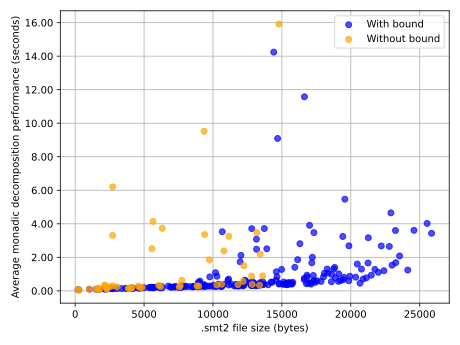
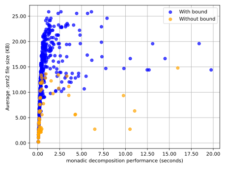
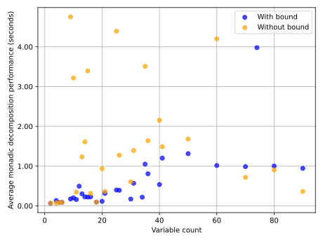
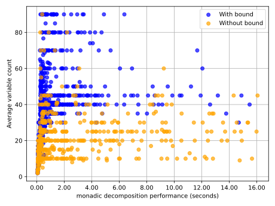
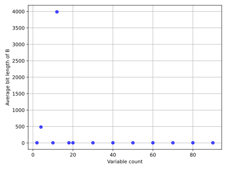
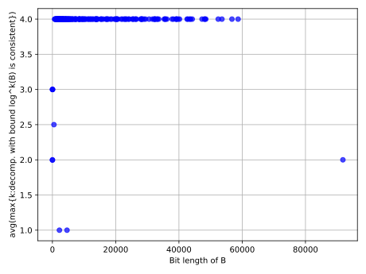
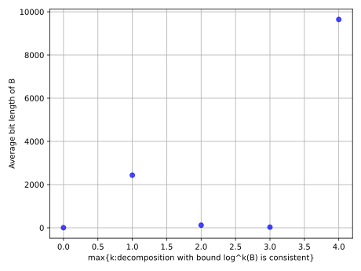

# PresMonDec

PresMonDec is at tool that checks whether a quantifier-free Formula in Presburger arithmetic is monadically decomposable. Congruence relations are supported.

# Installation

Following dependencies have to be installed in oder to use this project:
* [Z3 Prover](https://github.com/Z3Prover/z3)
* [numpy](https://numpy.org/)
* [matplotlib](https://matplotlib.org/)

To install z3, follow the tutorial corresponding to your operating system.
Please note that z3 should be available as a cli service for the monadic decomposition to work with timeouts.
Other mentioned dependencies can be installed using the following commands:
```shell
pip install numpy
pip install matplotlib
```

# Usage

Two different decomposability checking methods for Presburger arithmetic (over natural numbers) are implemented. Both of them can be used by importing the `src/presmondec.py` file.

The decomposability checker supports modular arithmetic, i.e. congruence relations like `5 * x ≡ 3 * y mod 7`. These relations must however be constructed using the `congruent` function defined in the same module.
The arguments are the left and right-hand sides as well as the modulo which must be a constant. So, for example, the above statement must be constructed using
```python
from z3 import *
from presmondec import congruent

x, y = Ints("x y z")
expr = congruent(5 * x, 3 * y, 7)
```
Also, the monadic decomposition is not guaranteed to work if the formula has satisfying assignments where some variable values are negative.
It is therefore required to add `x >= 0` constraints for all variables `x` if the formula doesn't already restrict negative values for variables. 

## First method

The first method is based on the [Monadic Decomposition in Integer Linear Arithmetic](https://arxiv.org/abs/2004.12371) paper by Matthew Hague, Anthony Widjaja Lin, Philipp Rümmer and Zhilin Wu.
It is important that there, a bound `B` for essentially the maximum value the formula can "address explicitly" is computed before constructing a formula for z3 that expresses the fact that the formula given is monadically decomposable.

To use this method, call the `monadic_decomposable` function which is located in `src/presmondec.py`.
The arguments are:
1. Formula to be tested
2. Variable that we want to test the monadic decomposition on
3. *Optional*: the bound `B` in case it is already known
4. *Optional*: Timeout (in milliseconds) after which the decomposition shall be aborted and the `MonDecTestFailed` exception shall be raised

## Second method

In the second method the monadic decomposition is tested by constructing a formula that essentlially describes the existence of a bound `B` with an existential quantifier.
In accordance with Proposition 2.3 in the paper above, such a bound exists and every element is equivalent to some element bounded by this bound if and only if the formula is monadically decomposable.

This method is implemented as a function `monadic_decomposable_without_bound` in `src/presmondec.py`. The arguments are:
1. Formula to be tested
2. Variable that we want to test the monadic decomposition on
3. *Optional*: An upper bound for the maximum of all minimal representatives of equivalence classes, where the equivalence relation is described in Proposition 2.3 in the paper above.
4. *Optional*: Timeout (in milliseconds) after which the decomposition shall be aborted and the `MonDecTestFailed` exception shall be raised

# Benchmark

TODO

## Results

**Note**: currently those are only preliminary benchmark results










