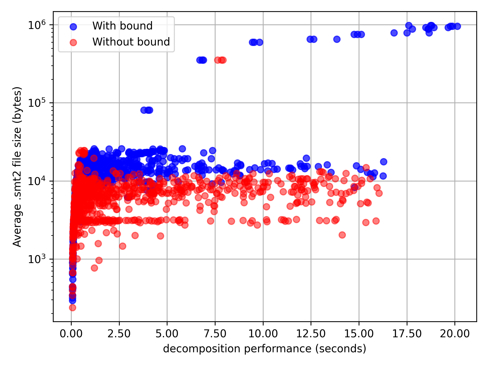
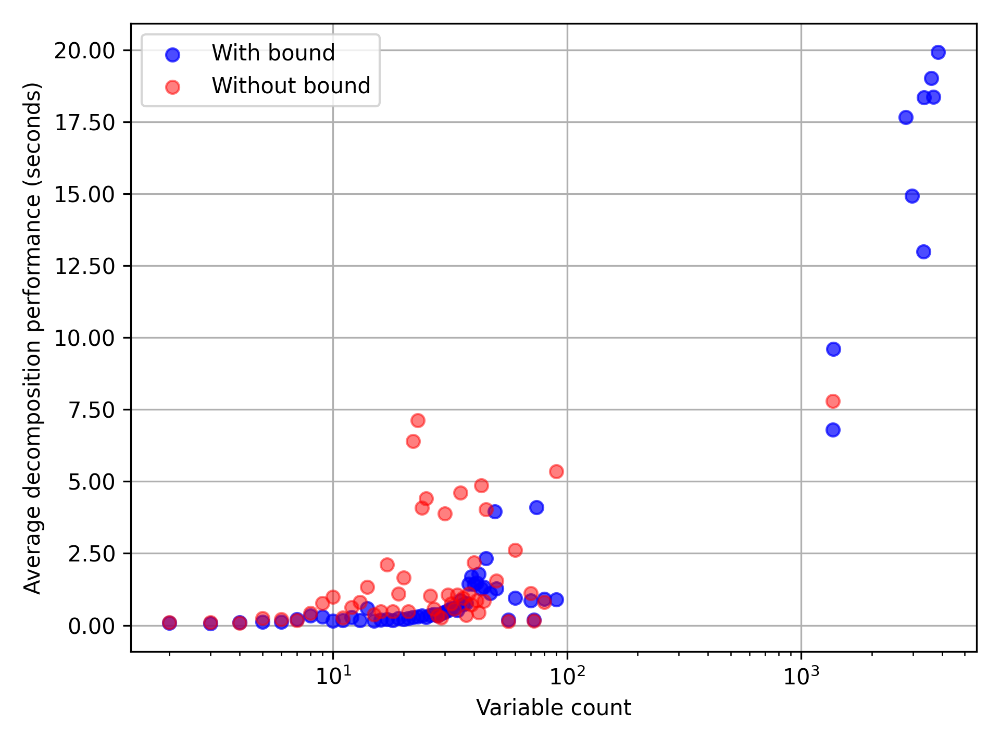

# PresMonDec

PresMonDec is a tool that checks whether a quantifier-free formula in Presburger arithmetic is monadically decomposable. Congruence relations are supported.

# Installation

Following dependencies have to be installed in order to be able to use all features of this project:
* [Z3](https://github.com/Z3Prover/z3)
* [numpy](https://numpy.org/)
* [matplotlib](https://matplotlib.org/)

Only `z3` is mandatory for the decomposition checkers.

To install `z3`, follow the official tutorial for your operating system.
Please note that `z3` should be available as a CLI service for the monadic decomposition to work when the timeout is specified explicitly (see the [Usage](#Usage) section below).
`numpy` and `matplotlib` can be installed as follows:
```shell
pip install numpy
pip install matplotlib
```

# Usage

Two different decomposability checking methods for Presburger arithmetic (over natural numbers) are implemented. Both of them can be used by importing the `src/presmondec.py` module.

The decomposability checkers support modular arithmetic, i.e. congruence relations like `5 * x ≡ 3 * y mod 7`. These relations must however be constructed using the `congruent` function defined in the same module.
The arguments are the left- and right-hand sides as well as the modulo, which must be a constant. For example, the above statement must be constructed using
```python
from z3 import *
from presmondec import congruent

x, y = Ints("x y z")
expr = congruent(5 * x, 3 * y, 7)
```
Also, the monadic decomposition may not work if the formula has satisfying assignments where some variable values are negative.
It is therefore important to add `x >= 0` constraints for all variables `x` if the formula doesn't already restrict negative values for variables. 

## First method

The first method is based on the [Monadic Decomposition in Integer Linear Arithmetic](https://arxiv.org/abs/2004.12371) paper by Matthew Hague, Anthony Widjaja Lin, Philipp Rümmer and Zhilin Wu.
It is important that in the implementation, an upper bound `B` for essentially the maximum value the formula can "address explicitly" is computed before constructing a `z3` formula that expresses the fact that the given formula is monadically decomposable.

To use this method, call the `monadic_decomposable` function from the `src/presmondec.py` module.
The arguments are:
1. Formula to be tested
2. Variable that we want to test the monadic decomposition on
3. *Optional*: The bound `B` in case it is already known (it can be computed using the `compute_bound` function)
4. *Optional*: Timeout (in milliseconds) after which the decomposition shall be aborted and the `MonDecTestFailed` exception shall be raised

### Example

```python
from z3 import *
from presmondec import monadic_decomposable, congruent

x, y, z = Ints("x y z")

phi = And([
    x >= 0,
    y >= 0,
    z >= 0,
    x + 2 * y >= 5,
    z < 5,
    congruent(x, y, 2)
])

# will return True because phi is monadically decomposable on x
dec = monadic_decomposable(phi, x)

print("Monadically decomposable on x:", dec)
```

## Second method

In the second method the monadic decomposition is tested by constructing a formula that essentially describes the existence of a bound `B` with an existential quantifier.
In accordance with Proposition 2.3 in the paper above, such a bound exists and every element is equivalent to some element bounded by this bound if and only if the formula is monadically decomposable.

This method is implemented as a function `monadic_decomposable_without_bound` in `src/presmondec.py`. The arguments are:
1. Formula to be tested
2. Variable that we want to test the monadic decomposition on
3. *Optional*: An upper bound for the maximum of all minimal representatives of equivalence classes, where the equivalence relation is described in Proposition 2.3 in the paper above.
4. *Optional*: Timeout (in milliseconds) after which the decomposition shall be aborted and the `MonDecTestFailed` exception shall be raised

### Example

```python
from z3 import *
from presmondec import monadic_decomposable_without_bound

x, y, z = Ints("x y z")

phi = And(Or(x == y, y == z), x >= y, y >= z, z >= 0)

# will return False because phi is not monadically decomposable on x
dec = monadic_decomposable_without_bound(phi, x)

print("Monadically decomposable on x:", dec)
```

# Benchmark

Both monadic decomposability checking methods can be tested on a (possibly very big) dataset of formulas by running
```
python benchmark.py [ITERATION_LIMIT] [VARS_PER_FORMULA_LIMIT] [SAT_CHECK_TIMEOUT_MS] [Z3_TIMEOUT_MS] [FILE_SIZE_LIMIT_KB]
```
where the five command-line arguments have the following meaning:
1. `[ITERATION_LIMIT]` is the maximum amount of formulas which should be considered by the benchmark without any errors - this means that both monadic decomposition methods should succeed for the current formula. Set this parameter to `0` to allow any amount of iterations.
2. `[VARS_PER_FORMULA_LIMIT]` is the maximum amount of variables per formula on which the formula should be monadically decomposed (using both methods). 
3. *Optional*: `[SAT_CHECK_TIMEOUT_MS]`: if some formula cannot be solved by `z3` within this amount of milliseconds, then the formula gets ignored by the benchmark. Set this parameter to `0` to disable prior running of `z3` to determine how fast it can determine satisfiability of a formula. **Default value**: `0`
4. *Optional*: `[Z3_TIMEOUT_MS]`: If a `z3` call initiated from inside a monadic decomposition check fails to produce an answer within the amount of milliseconds specified by this argument, `z3` is aborted and the benchmark considers the monadic decomposition method to have failed on the current formula & variable. Set this parameter to `0` to disable the timeout. **Default value**: `0`
5. *Optional*: `[FILE_SIZE_LIMIT_KB]` is the maximum `.smt2` file size in kilobytes, any files exceeding this limit will be ignored by the benchmark. If this parameter is set to `0`, the benchmark will consider all files regardless of their size. **Default value**: `0`   

The benchmark expects the input formulas to be in `.smt2` format located in the `benchmark` directory. In case that directory contains subdirectories, they will be traversed recursively. During benchmarking, the following data is written to the `benchmark_results` directory:
* Current statistical data, in (numpy) `.npz` file format. The files are prefixed by the iteration number, after which the data was exported.
* Logs are written to the `benchmark.log` file. In linux, they can be viewed live by running `tail -f benchmark.log`.

After benchmarking is complete, the final statistical data is also exported in the `.npz` format. The next section explains how to use this data. 

## Plotting the results

Once the benchmark is complete, the plots can be produced from the `.npz` files by running
```
benchmark_plot.py [ITER_NUMBER]
```
where `[ITER_NUMBER]` is the iteration number, which is the prefix of the `.npz` files containing data collected by the benchmark up to that iteration. Plotting will fail if there are no `.npz` files produced by the benchmark for the specified iteration number.

## Results

Following results were obtained by running the benchmark on the entire [QF_LIA database](https://clc-gitlab.cs.uiowa.edu:2443/SMT-LIB-benchmarks/QF_LIA) containing approximately 2.1 GB of linear integer arithmetic formulas.

The benchmark was run with the following parameters:
* No iteration limit
* Each formula was monadically decomposed on 3 variables (i.e. `[VARS_PER_FORMULA_LIMIT]` was set to 3)
* Sat check timeout: 2000 ms = 2 seconds
* Z3 timeout: 16000 ms = 16 seconds
* File size limit: 1000 KB = 1 MB

This table illustrates how many times each monadic decomposition method was run and what the corresponding error/success rate was:

| Monadic decomposition |   With bound    |  Without bound  |
| :-------------------: | :-------------: | :-------------: |
|   Executed (times)    |      4398       |      4331       |
|   Succeeded (times)   | 4331 (≈**98%**) | 1964 (≈**45%**) |
|    Failed (times)     |  67 (≈**2%**)   | 2367 (≈**55%**) |

We can therefore conclude that the monadic decomposition method with the bound is much more reliable compared to the version without it. We can compare the performance of both methods by considering the following plots:







The amount of variables seems to have some correlation with the average bit length of the bound `B`:


This plot clearly demonstrates that in the vast majority of cases, `B` is significantly larger compared to the real (tight) bound which would suffice. More precisely, in more than 97% of cases, we can reduce `B` to `log(log(B))` and obtain a consistent monadic decomposability result. And in more than 18% of cases, `B` can be even reduced to `log(log(log(log(B))))`.


This plot illustrates what values of `B` caused the distribution illustrated above:

